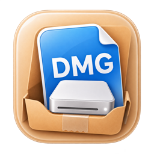

<div align="center">
  
  <h1>DMGplayer</h1>
  <p>A native visual DMG designer and builder for macOS.<br>原生、可视化的 macOS 磁盘映像设计与构建工具。</p>

  [](https://www.apple.com/macos/)
  [](https://www.swift.org/)
  [](LICENSE)
</div>

DMGplayer turns a folder or application into a polished macOS disk image without
requiring a hand-written shell script. Design the Finder window visually, run a
preflight check, then build the final DMG with Apple's system tools.

DMGplayer 可以把 App、文件或文件夹制作成带有完整 Finder 布局的 macOS 磁盘映像。
你可以直接在画布中设计窗口、执行构建前检查，并使用系统工具生成最终 DMG。

## Highlights / 功能

- Visual Finder-window canvas with drag, selection, alignment guides, snapping,
  equal-spacing hints, and precise positioning.
- Add applications, files, folders, an `/Applications` shortcut, text, and images.
- Solid color, image, or 3×3 mesh-gradient backgrounds with reusable presets.
- Quick Pack panel for turning an App into a DMG with minimal setup.
- APFS and HFS+ output; LZFSE, zlib, bzip2, or uncompressed images.
- Optional AES-128 and AES-256 disk-image encryption.
- Multi-language SLA/license resources and localized application UI.
- Build preflight for source files, bundle structure, layout, free space, mounted
  volumes, signing state, credentials, and output destination.
- Optional app signing and Apple notarization when users supply their own
  credentials. No credentials are included in this repository.
- Portable project packages plus compatibility with legacy JSON project files.
- Command-line entry points for automated validation and builds.

## Requirements / 系统要求

- macOS 14.0 Sonoma or later
- Xcode 26 or later for building from source
- Apple Silicon or Intel Mac; the downloadable build is Universal

The app relies on macOS tools including `hdiutil`, `codesign`, `notarytool`, and
Finder automation. It is intended to run on macOS rather than inside a sandboxed
cross-platform environment.

## Install / 安装

Download the latest DMG from the
[Releases page](https://github.com/maow318/DMGplayer-open/releases/latest), open
it, and drag DMGplayer into Applications.

下载最新版 DMG，打开后将 DMGplayer 拖入“应用程序”文件夹即可。

### About signing / 关于签名

Public builds are **ad-hoc signed** and are not notarized. They contain no Apple
Developer certificate and no Developer Team identifier. macOS may therefore ask
you to confirm the first launch. Use Finder's **Open** command from the context
menu, or approve the app in **System Settings → Privacy & Security**.

公开构建仅使用本地 ad-hoc 签名，没有开发者证书、Developer Team ID，也没有经过
Apple 公证。因此首次打开时 macOS 可能要求确认；请在 Finder 中右键选择“打开”，
或前往“系统设置 → 隐私与安全性”批准运行。

## Build from source / 从源码构建

Open `DMGplayer.xcodeproj` in Xcode, or run:

```sh
xcodebuild \
  -project DMGplayer.xcodeproj \
  -scheme DMGplayer \
  -configuration Debug \
  -destination 'platform=macOS' \
  build
```

The project is configured with manual ad-hoc signing:

```text
CODE_SIGN_IDENTITY = -
CODE_SIGN_STYLE = Manual
DEVELOPMENT_TEAM = ""
```

To distribute a signed and notarized fork, configure your own Apple Developer
Team and credentials. Never commit certificates, provisioning profiles, API
keys, app-specific passwords, or notarization profiles.

## Tests / 测试

```sh
xcodebuild \
  -project DMGplayer.xcodeproj \
  -scheme DMGplayer \
  -configuration Debug \
  -destination 'platform=macOS' \
  test
```

The test suite covers project encoding, build recovery, preflight rules,
selection, snapping, background layout, sidebar navigation, and localization.

## Privacy / 隐私

DMGplayer has no analytics or telemetry. Project editing and DMG creation happen
locally. Network access is only expected when you explicitly choose Apple
notarization, in which case Apple's `notarytool` communicates with Apple using a
credential profile stored in your Keychain.

DMGplayer 不包含统计或遥测功能。工程编辑与 DMG 构建均在本机完成；仅当你主动选择
Apple 公证时，系统 `notarytool` 才会使用钥匙串中的凭据连接 Apple 服务。

## Repository layout / 仓库结构

```text
DMGplayer/             Application source and assets
DMGplayerTests/        Unit and integration tests
DMGplayer.xcodeproj/   Xcode project
Info.plist             Document and exported-type declarations
```

Generated development builds, DerivedData, Xcode user state, local agent
settings, and signing material are intentionally excluded from version control.
The verified payload in `release-assets/` is retained only so GitHub Actions can
publish the downloadable DMG to the matching GitHub Release.

## License / 源码许可

DMGplayer is licensed under the
[PolyForm Noncommercial License 1.0.0](LICENSE).

This is a **source-available, noncommercial** license rather than an open-source
license. Personal, noncommercial use permitted by the license is free of license
fees. Educational, research, charitable, and other noncommercial uses permitted
by the license are also welcome.

Any commercial use, sale, paid distribution, monetized offering, or submission
to the Apple App Store, Mac App Store, Setapp, or another third-party software
marketplace requires the licensor's **prior written approval** and a separate
commercial license. Commercial licenses are reviewed case by case and require
an agreed licensing fee. See the [commercial licensing policy](COMMERCIAL-LICENSE.md)
and submit a [commercial license request](https://github.com/maow318/DMGplayer-open/issues/new?template=commercial-license.yml)
before any commercial release or store submission.

Redistributors must include the [license](LICENSE), [required notice](NOTICE),
and [commercial licensing policy](COMMERCIAL-LICENSE.md).

本项目采用 PolyForm Noncommercial 1.0.0 源码可见、仅限非商业用途的许可协议，
并非 OSI 定义的开源协议。协议允许的个人非商业用途免费使用，不收取许可费；学习、
研究、教育、公益等其他协议允许的非商业用途同样可以使用、修改和分发。

任何商业使用、销售、付费分发、变现行为，或提交到 Apple App Store、Mac App Store、
Setapp 及其他第三方软件平台，都必须事先取得许可方书面同意并签订单独的商业授权。
商业授权逐项审核，并按双方约定收取授权费。请先阅读[商业授权政策](COMMERCIAL-LICENSE.md)
并提交[商业授权申请](https://github.com/maow318/DMGplayer-open/issues/new?template=commercial-license.yml)；
在收到书面授权并满足授权费等全部条件之前，不得进行商业发布或上架。

再次分发时必须同时保留[完整许可证](LICENSE)、[必要声明](NOTICE)及
[商业授权政策](COMMERCIAL-LICENSE.md)。

## Contributing / 参与贡献

Issues and pull requests are welcome. Please include focused changes, keep local
or signing data out of commits, and run the test suite before submitting a PR.

欢迎提交 Issue 与 Pull Request。请保持改动聚焦，不要提交本机路径、签名材料或凭据，
并在提交 PR 前运行测试。
